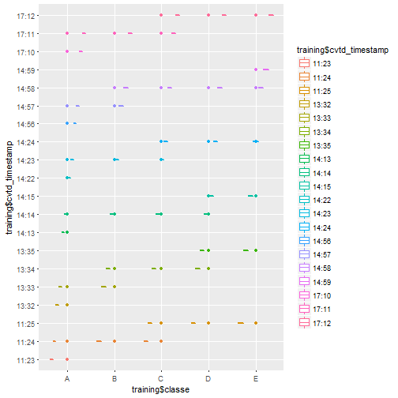
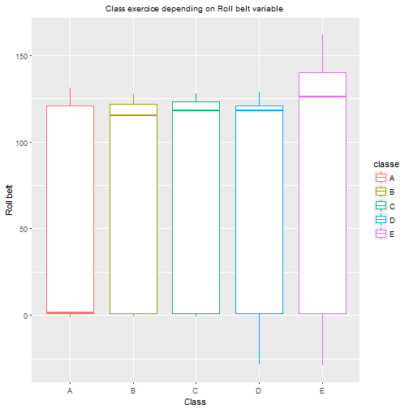
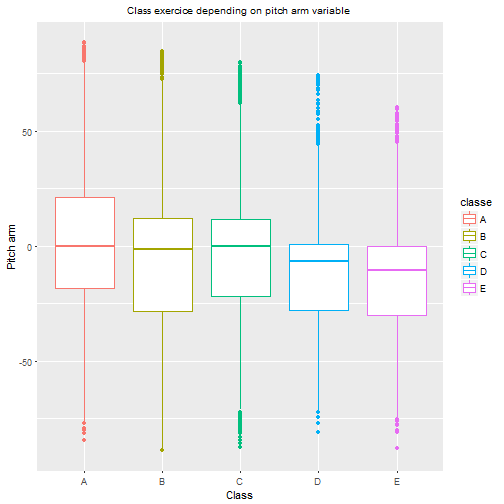
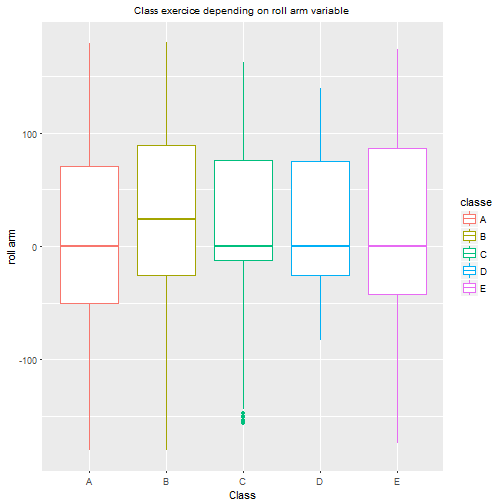

By jordiac, February 2017

#Summary
the following report aims to present the data analysis performed on the weight lifting exercices dataset provided by <http://groupware.les.inf.puc-rio.br/har>. The goal of this dataset is to investigate how well an activity is performed by the wearer. 

Six young health participants were asked to perform one set of 10 repetitions of the *Unilateral Dumbbell Biceps Curl* in 5 different fashions :

- **Class A** : exactly according to the specification

- **Class B** : throwing the elbows to the front

- **Class C** : lifting the dumbbell only halfway 

- **Class D** : lowering the dumbbell only halfway

- **Class E** : throwing the hips to the front 


**Class A** corresponds to the **specified execution** of the exercise, while the **other 4 classes** correspond to common **mistakes**. The exercises were performed by six male participants aged between 20-28 years, with little weight lifting experience. 


#Exploratory Data Analysis
Loading packages:


Let's have a quick look at the structure of the data set:

```
## 'data.frame':	19622 obs. of  160 variables:
##  $ X                       : int  1 2 3 4 5 6 7 8 9 10 ...
##  $ user_name               : Factor w/ 6 levels "adelmo","carlitos",..: 2 2 2 2 2 2 2 2 2 2 ...
##  $ raw_timestamp_part_1    : int  1323084231 1323084231 1323084231 1323084232 1323084232 1323084232 1323084232 1323084232 1323084232 1323084232 ...
##  $ raw_timestamp_part_2    : int  788290 808298 820366 120339 196328 304277 368296 440390 484323 484434 ...
##  $ cvtd_timestamp          : Factor w/ 20 levels "02/12/2011 13:32",..: 9 9 9 9 9 9 9 9 9 9 ...
##  $ new_window              : Factor w/ 2 levels "no","yes": 1 1 1 1 1 1 1 1 1 1 ...
##  $ num_window              : int  11 11 11 12 12 12 12 12 12 12 ...
##  $ roll_belt               : num  1.41 1.41 1.42 1.48 1.48 1.45 1.42 1.42 1.43 1.45 ...
##  $ pitch_belt              : num  8.07 8.07 8.07 8.05 8.07 8.06 8.09 8.13 8.16 8.17 ...
##  $ yaw_belt                : num  -94.4 -94.4 -94.4 -94.4 -94.4 -94.4 -94.4 -94.4 -94.4 -94.4 ...
##  $ total_accel_belt        : int  3 3 3 3 3 3 3 3 3 3 ...
##  $ kurtosis_roll_belt      : Factor w/ 397 levels "","-0.016850",..: 1 1 1 1 1 1 1 1 1 1 ...
##  $ kurtosis_picth_belt     : Factor w/ 317 levels "","-0.021887",..: 1 1 1 1 1 1 1 1 1 1 ...
##  $ kurtosis_yaw_belt       : Factor w/ 2 levels "","#DIV/0!": 1 1 1 1 1 1 1 1 1 1 ...
##  $ skewness_roll_belt      : Factor w/ 395 levels "","-0.003095",..: 1 1 1 1 1 1 1 1 1 1 ...
##  $ skewness_roll_belt.1    : Factor w/ 338 levels "","-0.005928",..: 1 1 1 1 1 1 1 1 1 1 ...
##  $ skewness_yaw_belt       : Factor w/ 2 levels "","#DIV/0!": 1 1 1 1 1 1 1 1 1 1 ...
##  $ max_roll_belt           : num  NA NA NA NA NA NA NA NA NA NA ...
##  $ max_picth_belt          : int  NA NA NA NA NA NA NA NA NA NA ...
##  $ max_yaw_belt            : Factor w/ 68 levels "","-0.1","-0.2",..: 1 1 1 1 1 1 1 1 1 1 ...
##  $ min_roll_belt           : num  NA NA NA NA NA NA NA NA NA NA ...
##  $ min_pitch_belt          : int  NA NA NA NA NA NA NA NA NA NA ...
##  $ min_yaw_belt            : Factor w/ 68 levels "","-0.1","-0.2",..: 1 1 1 1 1 1 1 1 1 1 ...
##  $ amplitude_roll_belt     : num  NA NA NA NA NA NA NA NA NA NA ...
##  $ amplitude_pitch_belt    : int  NA NA NA NA NA NA NA NA NA NA ...
##  $ amplitude_yaw_belt      : Factor w/ 4 levels "","#DIV/0!","0.00",..: 1 1 1 1 1 1 1 1 1 1 ...
##  $ var_total_accel_belt    : num  NA NA NA NA NA NA NA NA NA NA ...
##  $ avg_roll_belt           : num  NA NA NA NA NA NA NA NA NA NA ...
##  $ stddev_roll_belt        : num  NA NA NA NA NA NA NA NA NA NA ...
##  $ var_roll_belt           : num  NA NA NA NA NA NA NA NA NA NA ...
##  $ avg_pitch_belt          : num  NA NA NA NA NA NA NA NA NA NA ...
##  $ stddev_pitch_belt       : num  NA NA NA NA NA NA NA NA NA NA ...
##  $ var_pitch_belt          : num  NA NA NA NA NA NA NA NA NA NA ...
##  $ avg_yaw_belt            : num  NA NA NA NA NA NA NA NA NA NA ...
##  $ stddev_yaw_belt         : num  NA NA NA NA NA NA NA NA NA NA ...
##  $ var_yaw_belt            : num  NA NA NA NA NA NA NA NA NA NA ...
##  $ gyros_belt_x            : num  0 0.02 0 0.02 0.02 0.02 0.02 0.02 0.02 0.03 ...
##  $ gyros_belt_y            : num  0 0 0 0 0.02 0 0 0 0 0 ...
##  $ gyros_belt_z            : num  -0.02 -0.02 -0.02 -0.03 -0.02 -0.02 -0.02 -0.02 -0.02 0 ...
##  $ accel_belt_x            : int  -21 -22 -20 -22 -21 -21 -22 -22 -20 -21 ...
##  $ accel_belt_y            : int  4 4 5 3 2 4 3 4 2 4 ...
##  $ accel_belt_z            : int  22 22 23 21 24 21 21 21 24 22 ...
##  $ magnet_belt_x           : int  -3 -7 -2 -6 -6 0 -4 -2 1 -3 ...
##  $ magnet_belt_y           : int  599 608 600 604 600 603 599 603 602 609 ...
##  $ magnet_belt_z           : int  -313 -311 -305 -310 -302 -312 -311 -313 -312 -308 ...
##  $ roll_arm                : num  -128 -128 -128 -128 -128 -128 -128 -128 -128 -128 ...
##  $ pitch_arm               : num  22.5 22.5 22.5 22.1 22.1 22 21.9 21.8 21.7 21.6 ...
##  $ yaw_arm                 : num  -161 -161 -161 -161 -161 -161 -161 -161 -161 -161 ...
##  $ total_accel_arm         : int  34 34 34 34 34 34 34 34 34 34 ...
##  $ var_accel_arm           : num  NA NA NA NA NA NA NA NA NA NA ...
##  $ avg_roll_arm            : num  NA NA NA NA NA NA NA NA NA NA ...
##  $ stddev_roll_arm         : num  NA NA NA NA NA NA NA NA NA NA ...
##  $ var_roll_arm            : num  NA NA NA NA NA NA NA NA NA NA ...
##  $ avg_pitch_arm           : num  NA NA NA NA NA NA NA NA NA NA ...
##  $ stddev_pitch_arm        : num  NA NA NA NA NA NA NA NA NA NA ...
##  $ var_pitch_arm           : num  NA NA NA NA NA NA NA NA NA NA ...
##  $ avg_yaw_arm             : num  NA NA NA NA NA NA NA NA NA NA ...
##  $ stddev_yaw_arm          : num  NA NA NA NA NA NA NA NA NA NA ...
##  $ var_yaw_arm             : num  NA NA NA NA NA NA NA NA NA NA ...
##  $ gyros_arm_x             : num  0 0.02 0.02 0.02 0 0.02 0 0.02 0.02 0.02 ...
##  $ gyros_arm_y             : num  0 -0.02 -0.02 -0.03 -0.03 -0.03 -0.03 -0.02 -0.03 -0.03 ...
##  $ gyros_arm_z             : num  -0.02 -0.02 -0.02 0.02 0 0 0 0 -0.02 -0.02 ...
##  $ accel_arm_x             : int  -288 -290 -289 -289 -289 -289 -289 -289 -288 -288 ...
##  $ accel_arm_y             : int  109 110 110 111 111 111 111 111 109 110 ...
##  $ accel_arm_z             : int  -123 -125 -126 -123 -123 -122 -125 -124 -122 -124 ...
##  $ magnet_arm_x            : int  -368 -369 -368 -372 -374 -369 -373 -372 -369 -376 ...
##  $ magnet_arm_y            : int  337 337 344 344 337 342 336 338 341 334 ...
##  $ magnet_arm_z            : int  516 513 513 512 506 513 509 510 518 516 ...
##  $ kurtosis_roll_arm       : Factor w/ 330 levels "","-0.02438",..: 1 1 1 1 1 1 1 1 1 1 ...
##  $ kurtosis_picth_arm      : Factor w/ 328 levels "","-0.00484",..: 1 1 1 1 1 1 1 1 1 1 ...
##  $ kurtosis_yaw_arm        : Factor w/ 395 levels "","-0.01548",..: 1 1 1 1 1 1 1 1 1 1 ...
##  $ skewness_roll_arm       : Factor w/ 331 levels "","-0.00051",..: 1 1 1 1 1 1 1 1 1 1 ...
##  $ skewness_pitch_arm      : Factor w/ 328 levels "","-0.00184",..: 1 1 1 1 1 1 1 1 1 1 ...
##  $ skewness_yaw_arm        : Factor w/ 395 levels "","-0.00311",..: 1 1 1 1 1 1 1 1 1 1 ...
##  $ max_roll_arm            : num  NA NA NA NA NA NA NA NA NA NA ...
##  $ max_picth_arm           : num  NA NA NA NA NA NA NA NA NA NA ...
##  $ max_yaw_arm             : int  NA NA NA NA NA NA NA NA NA NA ...
##  $ min_roll_arm            : num  NA NA NA NA NA NA NA NA NA NA ...
##  $ min_pitch_arm           : num  NA NA NA NA NA NA NA NA NA NA ...
##  $ min_yaw_arm             : int  NA NA NA NA NA NA NA NA NA NA ...
##  $ amplitude_roll_arm      : num  NA NA NA NA NA NA NA NA NA NA ...
##  $ amplitude_pitch_arm     : num  NA NA NA NA NA NA NA NA NA NA ...
##  $ amplitude_yaw_arm       : int  NA NA NA NA NA NA NA NA NA NA ...
##  $ roll_dumbbell           : num  13.1 13.1 12.9 13.4 13.4 ...
##  $ pitch_dumbbell          : num  -70.5 -70.6 -70.3 -70.4 -70.4 ...
##  $ yaw_dumbbell            : num  -84.9 -84.7 -85.1 -84.9 -84.9 ...
##  $ kurtosis_roll_dumbbell  : Factor w/ 398 levels "","-0.0035","-0.0073",..: 1 1 1 1 1 1 1 1 1 1 ...
##  $ kurtosis_picth_dumbbell : Factor w/ 401 levels "","-0.0163","-0.0233",..: 1 1 1 1 1 1 1 1 1 1 ...
##  $ kurtosis_yaw_dumbbell   : Factor w/ 2 levels "","#DIV/0!": 1 1 1 1 1 1 1 1 1 1 ...
##  $ skewness_roll_dumbbell  : Factor w/ 401 levels "","-0.0082","-0.0096",..: 1 1 1 1 1 1 1 1 1 1 ...
##  $ skewness_pitch_dumbbell : Factor w/ 402 levels "","-0.0053","-0.0084",..: 1 1 1 1 1 1 1 1 1 1 ...
##  $ skewness_yaw_dumbbell   : Factor w/ 2 levels "","#DIV/0!": 1 1 1 1 1 1 1 1 1 1 ...
##  $ max_roll_dumbbell       : num  NA NA NA NA NA NA NA NA NA NA ...
##  $ max_picth_dumbbell      : num  NA NA NA NA NA NA NA NA NA NA ...
##  $ max_yaw_dumbbell        : Factor w/ 73 levels "","-0.1","-0.2",..: 1 1 1 1 1 1 1 1 1 1 ...
##  $ min_roll_dumbbell       : num  NA NA NA NA NA NA NA NA NA NA ...
##  $ min_pitch_dumbbell      : num  NA NA NA NA NA NA NA NA NA NA ...
##  $ min_yaw_dumbbell        : Factor w/ 73 levels "","-0.1","-0.2",..: 1 1 1 1 1 1 1 1 1 1 ...
##  $ amplitude_roll_dumbbell : num  NA NA NA NA NA NA NA NA NA NA ...
##   [list output truncated]
```

As we can see there are 160 variables in the data set which quite large. 

#Training and testing sets
Let's create the training and the testing sets for our prediction model.


```r
set.seed(250)

inTrain <- createDataPartition(y = train$classe, p=0.75, list=FALSE)
training <- train[inTrain,]
testing <- train[-inTrain,]
```

#Reducing variables
##Variability analysis
We perform a variability analysis on the training set in order to remove all the variables that remain constant.

```r
nsv <- nearZeroVar(training, saveMetrics = TRUE)
table(nsv$nzv)  ### 60 TRUE -->60 should be remove
```

```
## 
## FALSE  TRUE 
##   100    60
```

```r
col_remove <- c(nsv$nzv == TRUE)
training <- training[,!col_remove] ## removing zero variance variables from training set
testing <- testing[,!col_remove]   ## removing the same variables in the testing set
```

As observed, there were **60 variables** with near zero variance so they were **removed** from both **training** and **testing** sets.

##Unnecessary variables

We now remove the following variables:

- **X** : this count variable is meaningless to predict *classe*

- **user_name** : the name of the person who performed the exercices has no predicting value.

```r
training <- training[,-c(1,2)]  
testing <- testing[,-c(1,2)]
```

##Treating NA values

We have observed many of the variables have lots of Na values so we decide to **remove** all the variables that contain more than **45%** of NA values.


```r
na_max <- 0.45
vec_rem <- vector()

for (i in 1:(ncol(training)-1)) {
        aa <- table(is.na(training[,i]))
        if (length(aa) >1) {
                ratio <- aa[2]/(aa[1]+aa[2])
                if (ratio >na_max ) {
                        vec_rem <- c(vec_rem, i) 
                        ratio <-0
                }
        }
}

training[,vec_rem] <- NULL   ### remove all the variable with more that 45% of NA values
testing[,vec_rem] <- NULL    ### Remove the same vars in the testing set
dim(training)
```

```
## [1] 14718    57
```

so there are now **57 variables** (including the outcome) in the training and testing set.

##Analysing correlated variables

We take a look at the correlation between the different variables in the training set in order to remove those that are highly correlated to each other.

```r
mat_cor <- abs(cor(training[,-c(3,57)]))
diag(mat_cor) <- 0
cor_resu <- which(mat_cor >0.8, arr.ind = T)
cor_resu 
```

```
##                  row col
## yaw_belt           6   4
## total_accel_belt   7   4
## accel_belt_y      12   4
## accel_belt_z      13   4
## accel_belt_x      11   5
## magnet_belt_x     14   5
## roll_belt          4   6
## roll_belt          4   7
## accel_belt_y      12   7
## accel_belt_z      13   7
## pitch_belt         5  11
## magnet_belt_x     14  11
## roll_belt          4  12
## total_accel_belt   7  12
## accel_belt_z      13  12
## roll_belt          4  13
## total_accel_belt   7  13
## accel_belt_y      12  13
## pitch_belt         5  14
## accel_belt_x      11  14
## gyros_arm_y       22  21
## gyros_arm_x       21  22
## magnet_arm_x      27  24
## accel_arm_x       24  27
## magnet_arm_z      29  28
## magnet_arm_y      28  29
## accel_dumbbell_x  37  31
## accel_dumbbell_z  39  32
## gyros_dumbbell_z  36  34
## gyros_forearm_z   49  34
## gyros_dumbbell_x  34  36
## gyros_forearm_z   49  36
## pitch_dumbbell    31  37
## yaw_dumbbell      32  39
## gyros_forearm_z   49  48
## gyros_dumbbell_x  34  49
## gyros_dumbbell_z  36  49
## gyros_forearm_y   48  49
```

After looking at the covariance table hereabove, we have decided to remove the most correlated variables:


-**4th** : the *num_window* variable

-**7th** : the *yaw_belt* variable

-**12th** : the *accel_belt_x* variable

-**13th** : the *accel_belt_y* variable

-**49th** : the *gyros_forearm_y* variable


```r
training[, c(4, 7, 12,13,49)] <- NULL
testing[, c(4, 7, 12,13,49)] <- NULL
dim(training)
```

```
## [1] 14718    52
```


##Time variables
After plotting the time variable *cvtd_timestamp*, only the hour, depending on the *classe* var. we see that there is no evident relationship between both so we decide to **remove** time variables (**raw_timestamp_part_1**, **raw_timestamp_part_2** and **cvtd_timestamp**).





```r
## removing first and second and third time variables
training$raw_timestamp_part_1 <- NULL
training$raw_timestamp_part_2 <- NULL
training$cvtd_timestamp <- NULL

testing$raw_timestamp_part_1 <- NULL
testing$raw_timestamp_part_2 <- NULL
testing$cvtd_timestamp <- NULL

dim(training)
```

```
## [1] 14718    49
```


##Creating covariates

We still have 48 variable in our data sets which is too large if we want to obtain an efficient computing time. therefore we have decided to regroup **accel** & **gyros** & **magnet**  for **dumbell** / **forearm** / **arm** by applying the formula : *sqrt(X^2 + Y^2 + Z^2)*.

We only show the code for the **belt** variables:


```r
## removing first and second and third time variables
### FOR BELT RESULTS  *******************************************************
training$gyros_belt_res <- sqrt(training$gyros_belt_x^2 + training$gyros_belt_y^2 + training$gyros_belt_z^2 )
training$accel_belt_res <- sqrt(training$accel_belt_z^2 )
training$magnet_belt_res <- sqrt(training$magnet_belt_x^2 + training$magnet_belt_y^2 + training$magnet_belt_z^2 )

testing$gyros_belt_res <- sqrt(testing$gyros_belt_x^2 + testing$gyros_belt_y^2 + testing$gyros_belt_z^2 )
testing$accel_belt_res <- sqrt(testing$accel_belt_z^2 )
testing$magnet_belt_res <- sqrt(testing$magnet_belt_x^2 + testing$magnet_belt_y^2 + testing$magnet_belt_z^2 )

### Removing unnecessary variables
training$gyros_belt_x <- NULL
training$gyros_belt_y <- NULL
training$gyros_belt_z <- NULL

training$accel_belt_x <- NULL
training$accel_belt_y <- NULL
training$accel_belt_z <- NULL

training$magnet_belt_x <- NULL
training$magnet_belt_y <- NULL
training$magnet_belt_z <- NULL

## for testing set
testing$gyros_belt_x <- NULL
testing$gyros_belt_y <- NULL
testing$gyros_belt_z <- NULL

testing$accel_belt_x <- NULL
testing$accel_belt_y <- NULL
testing$accel_belt_z <- NULL

testing$magnet_belt_x <- NULL
testing$magnet_belt_y <- NULL
testing$magnet_belt_z <- NULL
##************************************************************************************
```


```r
dim(training)
```

```
## [1] 14718    28
```

So we finally obtain **28** variables (including the outcome).


##Plotting some variables

Let's **plot** some variables depending on the **classe** variable (outcome) in order to see if there are trends or not.








So we can see that there are **trends** between final variables and the outcome (**classe** variable) therefore it seems pretty sure we can now fit our model.


#Applying Machine Learning algorithn

We have decided to apply the **Random Forest** algorithm to predict the **classe** exercice depending on **27** variables.

After creating our **model fit**, we **predict** new values on the **testing** data set and then we get the **accuracy** of our prediction:


```r
modFit_rf <- train( classe ~ . , data=training, method="rf")
predic_rf <- predict(modFit_rf, testing)
resu_rf <- confusionMatrix(predic_rf, testing$classe)$overall
```


Therefore we have obtained a very accurate model (accuracy equals to **98.6%** ).

Now we can apply it to the validation set (20 cases).


